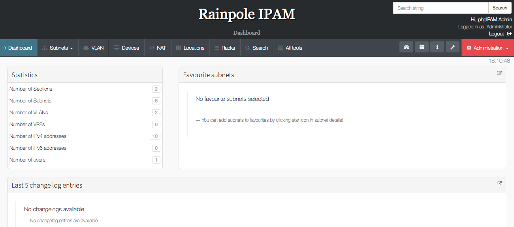

# phpIPam (PHP IP Address Management)
phpipam is an open-source web IP address management application. Its goal is to provide light and simple IP address management application.

Goal of this repository is to provide a lightweight docker image that can be used to have applciation running quickly.

## Running the application
I have tried to make it as simple as possible to run the application quickly. Therefore you can use docker-compose or just docker engine itself to start.

### Docker compose
```
wget https://raw.githubusercontent.com/burkeazbill/docker-phpipam/master/docker-compose.yml
docker-compose up -d
```
The above will start complete service which includes mysql container with database.
Before running you might want to change passwords being used as they have not been made for production environments.

### Docker engine
```
docker run -d --name phpIPAM \
           -p "8181:80" \
           -e MYSQL_DB_HOSTNAME=Welcome1
           -e MYSQL_DB_USERNAME=admin
           -e MYSQL_DB_PASSWORD=Password1
           -e MYSQL_DB_NAME=exampleDB
           -e MYSQL_DB_PORT=3306
           --network="bridge" \
           --restart=on-failure:3 \
           --log-driver=json-file \
           --log-opt max-size=100m \
           --log-opt max-file=3 \
           --log-opt labels=phpipam \
           rafpe/docker-phpipam

```

The above is minimalistic version which require you to provide details for mysql connection using environment variables.


### Configuration via environment variables

Image supports the use of the following env variables.

```shell
MYSQL_DB_HOSTNAME   
MYSQL_DB_USERNAME  
MYSQL_DB_PASSWORD   
MYSQL_DB_NAME        
MYSQL_DB_PORT         

SSL_ENABLED    # true/false, enable or disable SSL as a whole  
SSL_KEY        # path to an SSL key file. Only makes sense combined with ssl_cert  

SSL_CERT       # path to an SSL certificate file. Only makes sense combined with ssl_key  
SSL_CA         # path to a file containing SSL CA certs  
SSL_CAPATH     # path to a directory containing CA certs  
SSL_CIPHER     # one or more SSL Ciphers  

PROXY_ENABLED  # Enable/Disable usage of the Proxy server  
PROXY_HOST     # Proxy server FQDN or IP  
PROXY_PORT     # Proxy server port  
PROXY_USER     # Proxy Username  
PROXY_PASS     # Proxy Password  
PROXY_USEAUTH  # Enable/Disable Proxy authentication  
```
### vPod use: (HOL / Livefire /vRO MasterClass)
Once you have run docker-compose up -d 
1) Visit http://yourserver:8181 and choose the option to "Migrate phpipam installation"
2) On the next screen, click "Automatic database migration"
3) Enter your MySQL username and password (IE, phpipam / VMware1! )
4) Click the "Show advanced options" button and uncheck all three boxes
5) Click the M"igrate phpipam database", then click "Continue"

You may now login with the following username / password: admin / VMware1!

**NOTE:** The REST API has been enabled already in this configuration. To get started, you must:
POST (using basic auth -- admin / VMware1! ) to http://yourserver:8181/api/rest/users/
Then retrieve the token from the return and contine with your API usage as per the docs found here: https://phpipam.net/api/api_documentation/



## Change log
* **v1.0.0** : Initial fork RafPe/docker-phpipam
- Updated to 1.3, added php5-mcrypt and php5-curl -- required for API

* **v1.0.1** : Added phpMyAdmin container to docker-compose, running on port 8282
- Added a MIGRATE.sql to phpipam for use with VMware vPods (IE: HOLS, Livefire, vRO Master Class)
- Commented out (via Dockerfile) the 511 ErrorDocument in the API .htaccess file since it was being reported as invalid and preventing the API from working.

